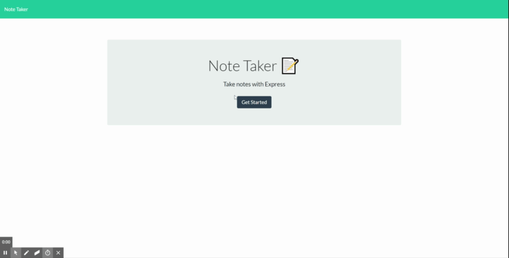

# UofT Full-Stack Web Development Bootcamp Project #9: Node.js/Express.js Note Taker

A Node.js/Express.js application that can be used to write, save, and delete notes

## Table of Contents

1. [About](#about)
1. [Business Context](#business-context)
1. [Minimum Requirements](#minimum-requirements)
1. [Bonus](#bonus)
1. [Submission](#submission)
1. [Development Strategy](#development-strategy)
1. [Built With](#built-with)
1. [Demo](#demo)
1. [Getting Started](#getting-started)

## About

Note Take is for users that need to keep track of a lot of information, it's easy to forget or be unable to recall something important. Being able to take persistent notes allows users to have written information available when needed.

## Business Context

```
AS A user, I want to be able to write and save notes

I WANT to be able to delete notes I've written before

SO THAT I can organize my thoughts and keep track of tasks I need to complete
```

## Minimum Requirements

Application should allow users to create and save notes.

Application should allow users to view previously saved notes.

Application should allow users to delete previously saved notes.

## Bonus

* Upgrade the pre-defined frontend

## Development Strategy

* The following HTML routes should be created:

  * GET `/notes` - Should return the `notes.html` file.

  * GET `*` - Should return the `index.html` file

* The application should have a `db.json` file on the backend that will be used to store and retrieve notes using the `fs` module.

* The following API routes should be created:

  * GET `/api/notes` - Should read the `db.json` file and return all saved notes as JSON.

  * POST `/api/notes` - Should recieve a new note to save on the request body, add it to the `db.json` file, and then return the new note to the client.

  * DELETE `/api/notes/:id` - Should recieve a query paramter containing the id of a note to delete. This means you'll need to find a way to give each note a unique `id` when it's saved. In order to delete a note, you'll need to read all notes from the `db.json` file, remove the note with the given `id` property, and then rewrite the notes to the `db.json` file.

Initial directory structure:

```
db/            // json files for databases
public/        // rendered output
templates/     // HTML template(s)
server.js      // Server app
```

## Built With

- [Node.js](https://nodejs.org/en/) - JavaScript Backend Runtime Environment
- [Express.js](http://expressjs.com/) - Web framework for Node.js 

## Demo



## Getting Started

1. Clone the repo:
```
https://github.com/saltamay/UofT_BootCamp_NoteTaker.git
```

2. Install the dependencies:
```
npm install
```

3. Run the app:
```
node server.js
```

Or, alternatively, you can go to:
```
https://uoft-bootcamp-notetaker.herokuapp.com/
```

## Submission on BCS

You are required to submit the following:

* The URL of the deployed application

* The URL of the GitHub repository

